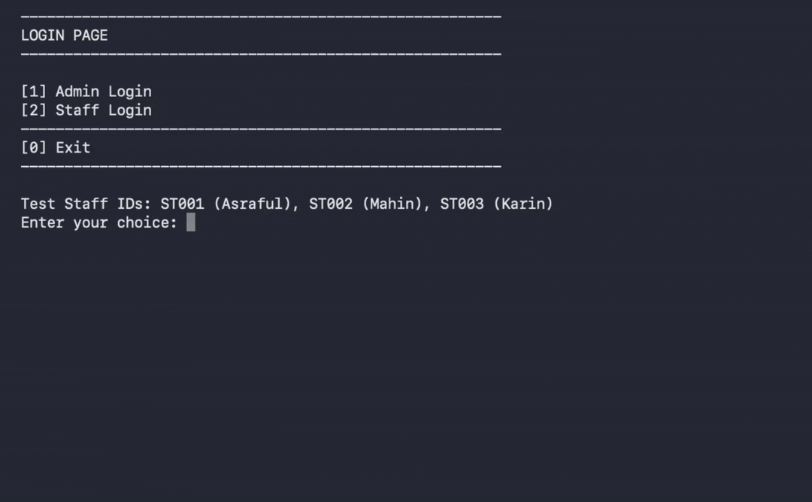

# Medical Store Management System
A console-based Medical Store Management System developed in **C** for the **SE 133 — Software Development Capstone Project** course.
The application helps manage a small pharmacy's medicine inventory, sales, billing, stock status, expiry dates, and staff-wise sales activity. Data is stored locally in text files, so records persist between program runs.

## Preview


## Features

### Role-Based Access

- **Admin login** with username and password
- **Staff login** using a staff ID
- Separate admin and staff menus

### Medicine Management

Admin users can:

- Add medicines with name, company, price, quantity, and expiry date
- View all stored medicines
- Search medicines by name using case-insensitive partial matching
- Update medicine details by ID
- Delete medicines by ID with confirmation
- Automatically assign incremental medicine IDs

### Sales and Billing

Staff users can:

- Sell one or more medicines in one transaction
- Enter customer name and phone number
- Check available stock before selling
- Prevent invalid quantities and sales beyond available stock
- Generate an itemized pharmacy bill with invoice number, date/time, customer details, staff details, and total amount
- View the latest generated bill

### Reports

Admin users can view:

- Sales history
- Staff-wise sales count and total sales amount
- Stock status, including `OUT OF STOCK`, `LOW STOCK`, and `OK`
- Expired medicine records
- Medicines identified as expiring soon by the program's date check

## Technologies Used

- C programming language
- Standard C libraries: `stdio.h`, `stdlib.h`, `string.h`, and `time.h`
- File handling for persistent local storage

## Project Files

| File | Purpose |
| --- | --- |
| `Medical Store MANAGEMENT SYSTEM.c` | Main source code for the application |
| `medicines.txt` | Created automatically to store medicine inventory records |
| `sales.txt` | Created automatically to store sales history and bills |
| `last_bill.txt` | Created automatically to store the most recent bill |

> The text data files are generated in the same directory where the program is run.

## How to Run

### 1. Clone the Repository

```bash
git clone https://github.com/efaz-codes/Capstone-Project.git
cd medical-store-management-system
```

### 2. Compile the Program

Using GCC:

```bash
gcc "Medical Store MANAGEMENT SYSTEM.c" -o medical_store
```

### 3. Run the Program

On macOS or Linux:

```bash
./medical_store
```

On Windows:

```bash
medical_store.exe
```

## Demo Login Credentials

### Admin

```text
Username: admin
Password: 1234
```

### Staff

| Staff ID | Staff Name |
| --- | --- |
| `ST001` | Asraful |
| `ST002` | Mahin |
| `ST003` | Karin |

## Usage Flow

1. Start the application.
2. Choose **Admin Login** or **Staff Login**.
3. Admins can manage medicines, review inventory, and view reports.
4. Staff can sell medicines and view the latest bill.
5. Inventory quantities are updated after each successful sale.
6. Sales and bills are saved to local text files.

## Data Format

Medicine records are stored in `medicines.txt` using this format:

```text
ID|Medicine Name|Company|Price|Quantity|Expiry Day|Expiry Month|Expiry Year
```

Example:

```text
1|Napa|Beximco|2.50|100|15|12|2027
```

## Notes

- The system supports up to **200 medicines** in memory.
- A single bill can contain up to **20 medicine items**.
- Invoice numbers begin from `INV-1001` and increase automatically.
- The included login credentials are intended for demonstration and academic-project use.
- This is a terminal-based application; no external database is required.

## Course Information

| Course Code | Course Title |
| --- | --- |
| SE 133 | Software Development Capstone Project |

## Author

Developed as a university capstone project.
